<div align="center">

<a href="https://samuray4ik04.github.io">
  <picture>
    <source media="(prefers-color-scheme: dark)" srcset="banner-dark.svg">
    
  </picture>
</a>

<br>

### *«любовь — это когда рядом светлее»* ✳

<br>

[](https://t.me/HolyZxc) [](https://tiktok.com/@samuray43k) [](https://samuray4ik04.github.io)

</div>

<br>

## ✦ О себе

```console
$ cat about.txt
пишу код по вайбу, остальное приложится

$ git commit -m "ещё чуть-чуть уюта" && git push
✓ опубликовано

$ vibe --check
✓ vibe is immaculate
```

## ✦ Стек

      

<br>

<div align="center">
<sub>真昼 · 藿藿 — a little sunshine. a little spirit.</sub>
</div>
